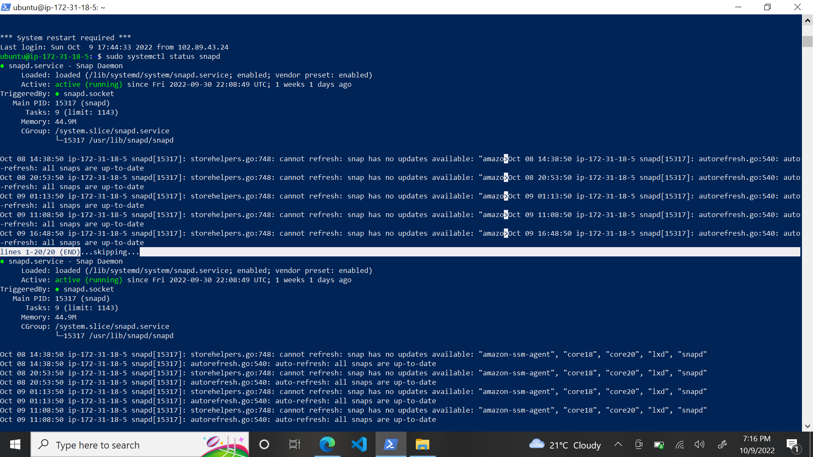

# project-10 documentation

## LOAD BALANCER SOLUTION WITH NGINX AND SSL/TLS

After Creating Ubuntu Server 20.04 TLS using Aws,

### Update and Install nginx
* sudo apt update
* sudo apt install nginx

### Updated nginx config file

#insert following configuration into http section

 upstream myproject {
    server 18.117.144.103;
    server 18.118.155.167;
  }

server {
    listen 80;
    server_name https://mateennodeblog.herokuapp.com;
    location / {
      proxy_set_header X-Forwarded-For $proxy_add_x_forwarded_for;
      proxy_pass http://web;
    }
  }
### Used Heroku app domain name
* https://mateennodeblog.herokuapp.com

### Install certbot and request for an SSL/TLS certificate
* sudo systemctl status snapd - check the snapd status

* sudo snap install --classic certbot
* sudo ln -s /snap/bin/certbot /usr/bin/certbot
* sudo certbot --nginx
# Certificate image
